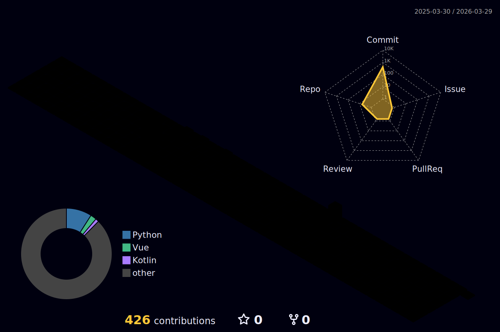

<!-- 🟢 매트릭스 배경 애니메이션 -->

---

<!-- ⌨️ 타이핑 애니메이션 -->

  

---

### 🛠️ Tech Stack

### 🧪 GitHub Stats & 📚 Blog

<table>
  <tr>
    <td align="center">
      
    </td>
    <td align="center">
      
      <a href="https://ucndewit.tistory.com/" target="_blank" style="display: inline-flex; align-items: center; gap: 6px;">
  <!-- Tistory SVG 로고 -->
  <svg role="img" height="24" width="24" viewBox="0 0 24 24" xmlns="http://www.w3.org/2000/svg">
    <title>Tistory</title>
    <path d="M0 3a3 3 0 1 0 6 0 3 3 0 0 0-6 0m9 18a3 3 0 1 0 6 0 3 3 0 0 0-6 0m0-9a3 3 0 1 0 6 0 3 3 0 0 0-6 0m0-9a3 3 0 1 0 6 0 3 3 0 0 0-6 0m9 0a3 3 0 1 0 6 0 3 3 0 0 0-6 0"/>
  </svg>

  <!-- Badge -->
  
</a>
        
      <strong>📚 Come and Check My Latest Upload.</strong>
    </td>
  </tr>
</table>

<!--
**CHOINEON/CHOINEON** is a ✨ _special_ ✨ repository because its `README.md` (this file) appears on your GitHub profile.

Here are some ideas to get you started:

- 🔭 I’m currently working on ...
- 🌱 I’m currently learning ...
- 👯 I’m looking to collaborate on ...
- 🤔 I’m looking for help with ...
- 💬 Ask me about ...
- 📫 How to reach me: ...
- 😄 Pronouns: ...
- ⚡ Fun fact: ...
-->
